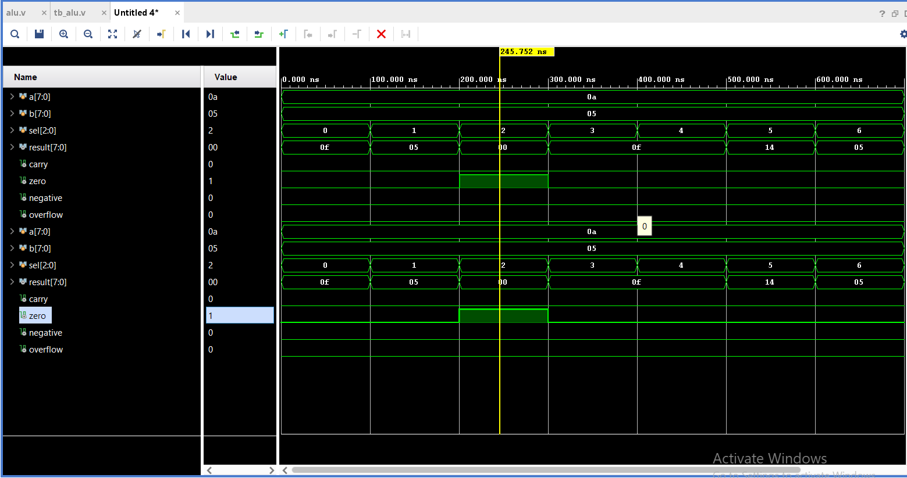

# 8-bit ALU using Verilog

## Overview
This project implements an 8-bit Arithmetic Logic Unit (ALU) using Verilog HDL.  
It supports arithmetic, logical, and shift operations along with processor flags.

## Features
- Addition and Subtraction
- AND, OR, XOR operations
- Shift Left and Shift Right
- Flags:
  - Carry
  - Zero
  - Negative
  - Overflow

## Design Details
- Combinational logic using `always @(*)`
- Case-based operation selection
- Flag generation based on result conditions

## Simulation
- Tool: Xilinx Vivado
- Verified using a testbench with:
  - Normal operations
  - Edge cases:
    - Overflow (127 + 1)
    - Carry (255 + 1)
    - Negative result (5 - 10)
    - Zero result (5 - 5)

## Waveform Output

## Learning Outcome
- Understanding of ALU architecture
- Flag computation (carry, zero, negative, overflow)
- Writing effective testbenches
- Simulation and debugging using Vivado

## Author
Mohd Ehsan Muzammil
